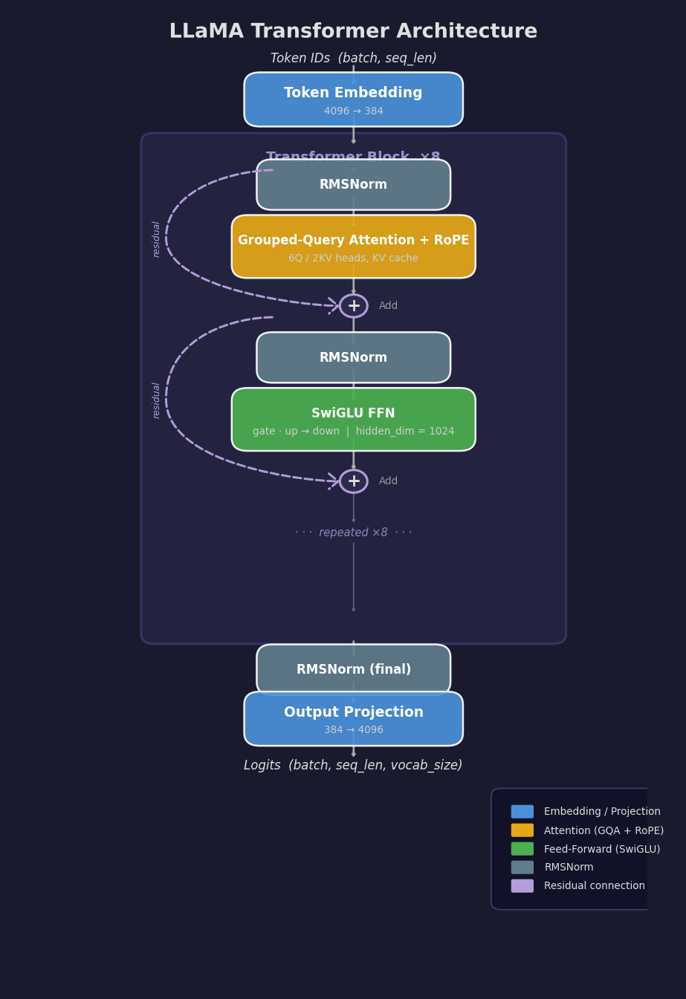
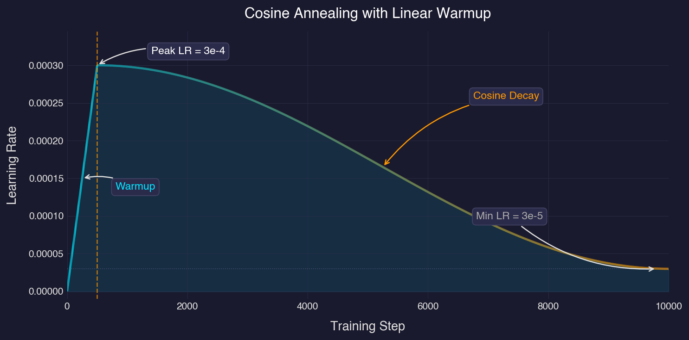

# llama-vc

A complete, educational implementation of a **LLaMA-style language model** (~15.74M parameters) built from scratch in pure PyTorch. Trains on [TinyStories](https://huggingface.co/datasets/roneneldan/TinyStories) and generates coherent short stories.

This project implements every component of the LLaMA architecture — RMSNorm, Rotary Positional Embeddings, SwiGLU, Grouped Query Attention, KV cache — with no external model libraries. Every module is heavily commented and designed for learning.

---

## Overview

| | |
|---|---|
| **Parameters** | 15,735,168 (15.74M) |
| **Architecture** | Decoder-only transformer (LLaMA) |
| **Training data** | TinyStories (~2.1M stories, ~300M tokens) |
| **Tokenizer** | SentencePiece BPE, 4096 vocab, byte-fallback |
| **Context length** | 512 tokens |
| **Training time** | ~15 min (A100), ~3.5 hrs (M4 Pro). T4 runs out of memory at default settings |
| **Target perplexity** | ~3–5 on TinyStories validation |

### Why this project?

Most LLM tutorials skip the details. This project is a single codebase where you can read, modify, and train a real LLaMA model end-to-end. Every design choice is documented in the code comments — from why beta2=0.95 instead of 0.999, to why SwiGLU uses 3 matrices instead of 2.

---

## Datasets

4 datasets, 5 training options. Each dataset can be used independently, or all four can be combined via `mixed`:

| `--dataset` | Type | HuggingFace Path | Size | Description |
|---|---|---|---|---|
| **tinystories** (default) | Dataset | `roneneldan/TinyStories` | ~2.1M examples | Short children's stories generated by GPT-3.5/4 |
| **gsm8k** | Dataset | `openai/gsm8k` | 8.5K examples | Grade school math word problems with step-by-step solutions |
| **simplemath** | Dataset | `ProCreations/SimpleMath` | 100K examples | Basic arithmetic (75K equations + 25K word problems) |
| **aqua_rat** | Dataset | `deepmind/aqua_rat` | 98K examples | Word problems with multiple choice, rationale, and answer |
| **mixed** | Combination | — | All combined | Concatenates all 4 datasets into one `.bin` file |

**Example formats after preprocessing:**

```
# tinystories
Once upon a time, there was a little cat who loved to play in the garden...

# gsm8k
Question: Natalia sold clips to 48 of her friends in April, and then she sold half
as many clips in May. How many clips did Natalia sell altogether in April and May?
Answer: Natalia sold 48/2 = <<48/2=24>>24 clips in May.
Natalia sold 48+24 = <<48+24=72>>72 clips altogether in April and May.
#### 72

# simplemath
2790 + 6698
Answer: 9488

# aqua_rat
Question: A grocery sells a bag of ice for $1.25, and makes 20% profit.
If it sells 500 bags of ice, how much total profit does it make?
Options: A)125, B)150, C)225, D)250, E)275
Rationale: Profit per bag = 1.25 * 0.20 = 0.25. Total = 500 * 0.25 = 125.
Answer: A
```

---

## Architecture

### Architecture Comparison

This project follows the LLaMA 2 architecture, scaled down to ~15M parameters. GQA is borrowed from the LLaMA 2 70B variant (the 7B used standard MHA).

**Design choices:**

| Component | Vanilla Transformer | LLaMA 2 (7B) | **llama-vc (this project)** |
|---|---|---|---|
| Normalization | LayerNorm (post-norm) | RMSNorm (pre-norm) | **RMSNorm (pre-norm)** |
| Positional encoding | Learned / sinusoidal | RoPE | **RoPE** |
| FFN activation | ReLU / GELU | SwiGLU | **SwiGLU** |
| Attention | Multi-Head Attention | MHA (GQA in 70B only) | **GQA** (from 70B design) |
| Bias terms | Yes | No | **No** |
| Dropout | Yes | No | **No** |
| FFN structure | 2 matrices | 3 matrices (gate + up + down) | **3 matrices** |

**Hyperparameters:**

| Parameter | LLaMA 2 7B | **llama-vc** | Scale factor |
|---|---|---|---|
| Parameters | 6.7B | **15.74M** | ~426× smaller |
| `dim` | 4096 | **384** | 10.7× |
| `n_layers` | 32 | **8** | 4× |
| `n_heads` | 32 | **6** | 5.3× |
| `n_kv_heads` | 32 (MHA) | **2** (GQA 3:1) | — |
| `head_dim` | 128 | **64** | 2× |
| `hidden_dim` | 11008 | **1024** | 10.75× |
| `vocab_size` | 32000 | **4096** | 7.8× |
| `max_seq_len` | 4096 | **512** | 8× |
| `rope_theta` | 10000.0 | **10000.0** | same |
| `norm_eps` | 1e-6 | **1e-5** | — |

Both use the same `hidden_dim` formula: `(8/3) × dim` rounded for hardware alignment (LLaMA 2: `(8/3) × 4096 ≈ 10923` → 11008; ours: `(8/3) × 384 ≈ 1024`).

### Parameter Breakdown


### Data Flow



---

## Project Structure

```
llama-vc/
├── llama_vc/                  # Core package
│   ├── __init__.py            # Package metadata, version
│   ├── config.py              # ModelConfig & TrainConfig dataclasses
│   ├── model.py               # Full LLaMA architecture
│   ├── tokenizer.py           # SentencePiece BPE tokenizer wrapper
│   ├── dataset.py             # Multi-dataset download, tokenization, DataLoader
│   ├── train.py               # Training loop with mixed precision
│   ├── generate.py            # Inference with KV cache & sampling
│   ├── device.py              # Hardware abstraction (CUDA/MPS/CPU)
│   └── utils.py               # Logging, checkpointing, timing
├── scripts/                   # CLI entry points
│   ├── train_tokenizer.py     # Download datasets & train BPE tokenizer
│   ├── train_model.py         # Main training script
│   ├── generate_text.py       # Interactive text generation
│   └── eval_model.py          # Validation set evaluation
├── tests/                     # Unit tests (pytest)
│   ├── test_model.py          # Architecture, shapes, gradients, KV cache
│   ├── test_generate.py       # Sampling strategies & cache correctness
│   ├── test_rope.py           # RoPE mathematical properties
│   └── test_tokenizer.py      # Roundtrip, byte-fallback, special tokens
├── notebooks/
│   └── llama_vc_colab.ipynb   # End-to-end Google Colab notebook
├── data/                      # Generated at runtime (gitignored)
├── checkpoints/               # Model checkpoints (gitignored)
├── logs/                      # Training logs (gitignored)
├── requirements.txt
├── pyproject.toml
└── .gitignore
```

---

## Quick Start

```bash
# 1. Install dependencies
pip install -r requirements.txt

# 2. Train tokenizer (downloads TinyStories, trains BPE)
python scripts/train_tokenizer.py

# 3. Train model (~3.5 hrs on M4 Pro, ~15 min on A100)
python scripts/train_model.py

# 4. Generate text
python scripts/generate_text.py --checkpoint checkpoints/best.pt
```

**To train on math datasets:**

```bash
# Train tokenizer on all datasets (stories + math)
python scripts/train_tokenizer.py --datasets all

# Train on a specific math dataset
python scripts/train_model.py --dataset gsm8k

# Train on all datasets combined
python scripts/train_model.py --dataset mixed
```

---

## Detailed Usage

### `train_tokenizer.py`

Downloads selected datasets from HuggingFace and trains a SentencePiece BPE tokenizer on all of them.

```
python scripts/train_tokenizer.py [OPTIONS]
```

| Flag | Type | Default | Description |
|---|---|---|---|
| `--vocab-size` | int | `4096` | Vocabulary size. Consider `8192` when including math datasets |
| `--data-dir` | str | `data/` | Directory for data files |
| `--datasets` | str+ | `tinystories` | Datasets to include. Choices: `tinystories`, `gsm8k`, `simplemath`, `aqua_rat`, `all` |
| `--max-examples` | int | `-1` | Max examples per dataset (`-1` = all). Use e.g. `100000` for faster dev iteration |

**Outputs:** `data/{dataset}/train.txt` for each dataset, `data/tokenizer.model`, `data/tokenizer.vocab`

```bash
# TinyStories only (default, backward compatible)
python scripts/train_tokenizer.py

# All datasets (stories + math)
python scripts/train_tokenizer.py --datasets all

# Specific math datasets with larger vocab
python scripts/train_tokenizer.py --datasets tinystories gsm8k --vocab-size 8192
```

### `train_model.py`

Train the LLaMA model on a selected dataset. Prerequisite: run `train_tokenizer.py` first (with matching `--datasets`).

```
python scripts/train_model.py [OPTIONS]
```

**Dataset:**

| Flag | Type | Default | Description |
|---|---|---|---|
| `--dataset` | str | `tinystories` | Dataset to train on: `tinystories`, `gsm8k`, `simplemath`, `aqua_rat`, `mixed` |

**Model Architecture:**

| Flag | Type | Default | Description |
|---|---|---|---|
| `--dim` | int | `384` | Model dimension (hidden state size) |
| `--n-layers` | int | `8` | Number of transformer layers |
| `--n-heads` | int | `6` | Number of query attention heads |
| `--n-kv-heads` | int | `2` | Number of KV heads (GQA) |
| `--hidden-dim` | int | `1024` | FFN intermediate dimension (SwiGLU) |
| `--max-seq-len` | int | `512` | Maximum sequence length |
| `--vocab-size` | int | `4096` | Vocabulary size (must match tokenizer) |
| `--weight-tying` | flag | `False` | Share embedding and output weights (saves 1.57M params) |
| `--gradient-checkpointing` | flag | `False` | Trade compute for memory (~30% slower, ~60% less memory) |

**Training:**

| Flag | Type | Default | Description |
|---|---|---|---|
| `--batch-size` | int | `64` | Micro-batch size |
| `--grad-accum` | int | `4` | Gradient accumulation steps. Effective batch = batch-size × grad-accum |
| `--max-steps` | int | `10000` | Total optimizer steps |
| `--warmup-steps` | int | `500` | Linear warmup duration |
| `--lr` | float | `3e-4` | Peak learning rate |
| `--min-lr` | float | `3e-5` | Minimum learning rate (floor, 10% of peak) |
| `--weight-decay` | float | `0.1` | L2 regularization (AdamW, 2D params only) |
| `--max-grad-norm` | float | `1.0` | Gradient clipping threshold |
| `--dtype` | choice | `auto` | Precision: `auto`, `float16`, `bfloat16`, `float32` |
| `--compile` | flag | `False` | `torch.compile` JIT (CUDA only, 10–30% speedup) |
| `--seed` | int | `42` | Random seed |

**Evaluation & Checkpointing:**

| Flag | Type | Default | Description |
|---|---|---|---|
| `--eval-interval` | int | `250` | Evaluate every N steps |
| `--eval-steps` | int | `20` | Batches per evaluation |
| `--save-interval` | int | `1000` | Save checkpoint every N steps |
| `--log-interval` | int | `10` | Log metrics every N steps |

**Paths:**

| Flag | Type | Default | Description |
|---|---|---|---|
| `--data-dir` | str | `data/` | Data directory |
| `--checkpoint-dir` | str | `checkpoints/` | Checkpoint directory |
| `--log-dir` | str | `logs/` | Log directory |
| `--tokenizer-path` | str | `data/tokenizer.model` | Tokenizer model path |
| `--resume` | str | `None` | Checkpoint path to resume training from |

```bash
# Train on GSM8K math problems
python scripts/train_model.py --dataset gsm8k

# Train on all datasets combined
python scripts/train_model.py --dataset mixed

# Resume from checkpoint
python scripts/train_model.py --resume checkpoints/step_005000.pt

# Smaller model for testing
python scripts/train_model.py --dim 256 --n-layers 4 --n-heads 4 --n-kv-heads 1 --hidden-dim 512

# Enable torch.compile on CUDA
python scripts/train_model.py --compile --dtype bfloat16
```

### `generate_text.py`

Generate text from a trained model. Supports single-prompt and interactive modes.

```
python scripts/generate_text.py --checkpoint <path> [OPTIONS]
```

| Flag | Type | Default | Description |
|---|---|---|---|
| `--checkpoint` | str | **required** | Path to model checkpoint (`.pt` file) |
| `--tokenizer-path` | str | `data/tokenizer.model` | Path to tokenizer model |
| `--prompt` | str | `None` | Single prompt (omit for interactive mode) |
| `--max-new-tokens` | int | `200` | Maximum tokens to generate |
| `--temperature` | float | `0.8` | Sampling temperature (`0` = greedy, `1` = default, `>1` = more random) |
| `--top-k` | int | `40` | Top-k sampling (`0` = disabled) |
| `--top-p` | float | `0.9` | Nucleus sampling threshold (`1.0` = disabled) |

```bash
# Interactive mode
python scripts/generate_text.py --checkpoint checkpoints/best.pt

# Single prompt, more creative
python scripts/generate_text.py --checkpoint checkpoints/best.pt \
    --prompt "Once upon a time" --temperature 1.2 --top-k 50

# Deterministic greedy decoding
python scripts/generate_text.py --checkpoint checkpoints/best.pt \
    --prompt "The little cat" --temperature 0.0

# Longer generation
python scripts/generate_text.py --checkpoint checkpoints/best.pt \
    --prompt "One day" --max-new-tokens 500
```

**Interactive mode commands:** type a prompt + Enter to generate, `quit` to exit, `settings` to view parameters.

### `eval_model.py`

Evaluate a trained model on the validation set. Reports loss, perplexity, and throughput.

```
python scripts/eval_model.py --checkpoint <path> [OPTIONS]
```

| Flag | Type | Default | Description |
|---|---|---|---|
| `--checkpoint` | str | **required** | Checkpoint path |
| `--tokenizer-path` | str | `data/tokenizer.model` | Tokenizer model path |
| `--val-data` | str | `data/val.bin` | Validation data path |
| `--batch-size` | int | `64` | Evaluation batch size |
| `--max-batches` | int | `-1` | Max batches (`-1` = all) |
| `--dtype` | str | `auto` | Evaluation precision |

```bash
python scripts/eval_model.py --checkpoint checkpoints/best.pt
python scripts/eval_model.py --checkpoint checkpoints/best.pt --max-batches 50
```

---

## Google Colab

The notebook at [`notebooks/llama_vc_colab.ipynb`](notebooks/llama_vc_colab.ipynb) runs the full pipeline on a free Colab GPU:

1. Installs dependencies and clones the repo
2. Trains the BPE tokenizer
3. Downloads and tokenizes TinyStories
4. Trains the model (default 3000 steps, ~15 min on T4)
5. Evaluates on validation set
6. Generates sample stories
7. Saves and downloads the checkpoint

**To use:** Open the notebook in Colab, set runtime to GPU (*Runtime > Change runtime type > GPU*), and run all cells. Every cell has a `#@title` header and all configuration is in the second cell.

---

## Configuration Reference

### ModelConfig

Defined in `llama_vc/config.py`. Controls model architecture — changing any field creates an incompatible model.

| Field | Type | Default | Description |
|---|---|---|---|
| `vocab_size` | int | `4096` | BPE vocabulary size |
| `dim` | int | `384` | Model dimension (hidden state width) |
| `n_layers` | int | `8` | Number of transformer decoder layers |
| `n_heads` | int | `6` | Number of query attention heads |
| `n_kv_heads` | int | `2` | Number of key/value heads (GQA). Ratio: 6Q : 2KV = 3:1 |
| `hidden_dim` | int | `1024` | SwiGLU FFN intermediate dimension |
| `max_seq_len` | int | `512` | Maximum sequence length (RoPE precomputation bound) |
| `norm_eps` | float | `1e-5` | RMSNorm epsilon |
| `rope_theta` | float | `10000.0` | RoPE base frequency |
| `dropout` | float | `0.0` | Dropout probability (LLaMA uses 0) |
| `use_gradient_checkpointing` | bool | `False` | Trade compute for memory |
| `weight_tying` | bool | `False` | Share embedding and output projection weights |

**Computed properties:**
- `head_dim` = dim / n_heads = 64
- `n_kv_groups` = n_heads / n_kv_heads = 3

### TrainConfig

Defined in `llama_vc/config.py`. Controls training — can be changed between runs without affecting model loading.

| Field | Type | Default | Description |
|---|---|---|---|
| `batch_size` | int | `64` | Micro-batch size (sequences per forward pass) |
| `gradient_accumulation_steps` | int | `4` | Micro-batches per optimizer step. Effective batch = 256 sequences |
| `max_steps` | int | `10000` | Total optimizer steps (~1.3B tokens, ~4.4 epochs) |
| `warmup_steps` | int | `500` | Linear warmup duration |
| `learning_rate` | float | `3e-4` | Peak learning rate (after warmup) |
| `min_learning_rate` | float | `3e-5` | Floor learning rate (10% of peak) |
| `weight_decay` | float | `0.1` | AdamW L2 regularization (2D params only) |
| `beta1` | float | `0.9` | Adam first moment decay |
| `beta2` | float | `0.95` | Adam second moment decay (LLaMA convention) |
| `max_grad_norm` | float | `1.0` | Gradient clipping threshold |
| `dtype` | str | `"auto"` | Mixed precision: auto, float16, bfloat16, float32 |
| `compile_model` | bool | `False` | `torch.compile` JIT (CUDA only) |
| `eval_interval` | int | `250` | Evaluate every N steps |
| `eval_steps` | int | `20` | Batches per evaluation |
| `save_interval` | int | `1000` | Checkpoint every N steps |
| `log_interval` | int | `10` | Log metrics every N steps |
| `seed` | int | `42` | Random seed |
| `data_dir` | str | `"data/"` | Data directory |
| `checkpoint_dir` | str | `"checkpoints/"` | Checkpoint directory |
| `log_dir` | str | `"logs/"` | Log directory |
| `tokenizer_path` | str | `"data/tokenizer.model"` | Tokenizer path |

---

## Module Guide

### `config.py` — Configuration

Single source of truth for all hyperparameters. Two dataclasses: `ModelConfig` (architecture) and `TrainConfig` (training). Supports serialization to/from dicts and JSON for checkpoint storage.

### `model.py` — LLaMA Architecture

The complete model in one file:

- **`RMSNorm`** — Root Mean Square normalization. No mean centering, no beta. Formula: `x / sqrt(mean(x²) + eps) * gamma`. ~7–10% faster than LayerNorm.
- **`precompute_rope_frequencies`** — Precomputes cos/sin tables for RoPE. Returns `(freqs_cos, freqs_sin)` of shape `(max_seq_len, head_dim // 2)`.
- **`apply_rotary_embeddings`** — Applies RoPE rotation to Q and K tensors. Preserves vector magnitude (rotation is an isometry).
- **`FeedForward`** — SwiGLU FFN with three weight matrices (gate, up, down). `output = (Swish(x·W_gate) * x·W_up) · W_down`. No bias terms.
- **`Attention`** — Grouped Query Attention. 6 query heads share 2 KV heads. Supports KV cache for efficient autoregressive inference. Uses PyTorch's `scaled_dot_product_attention` (FlashAttention-2 on A100).
- **`TransformerBlock`** — One decoder layer: pre-norm → attention → residual → pre-norm → FFN → residual.
- **`LLaMA`** — Complete model: embedding → N transformer blocks → RMSNorm → output projection. Returns `(logits, loss)` for training or `(logits, loss, kv_caches)` for cached inference.

### `tokenizer.py` — SentencePiece BPE

- **`train_tokenizer`** — Train a BPE tokenizer with byte-fallback, digit splitting, identity normalization.
- **`Tokenizer`** — Wrapper around SentencePiece. `encode(text, bos, eos)` → token IDs, `decode(tokens)` → text. Token layout: 0=`<unk>`, 1=`<s>` (BOS), 2=`</s>` (EOS), 3–258=byte tokens, 259–4095=BPE subwords.

### `dataset.py` — Data Pipeline

- **`DATASETS`** — Registry of supported datasets (TinyStories, GSM8K, SimpleMath, AQUA-RAT) with HuggingFace paths, split names, and formatter functions.
- **`download_dataset(name, data_dir)`** — Generic dataset downloader. Fetches from HuggingFace, formats examples, exports train/val text files. Handles datasets with no validation split by auto-creating one.
- **`prepare_dataset(name, data_dir, tokenizer)`** — Download + tokenize a single dataset to `.bin` files.
- **`prepare_mixed(data_dir, tokenizer)`** — Prepare all datasets and concatenate into a combined mixed dataset.
- **`tokenize_and_save`** — Tokenize text to uint16 binary (memory-mapped). Uses multiprocessing.
- **`TokenDataset`** — Memory-mapped dataset. Returns random contiguous `(input, target)` windows of `seq_len` tokens.
- **`create_dataloader`** — PyTorch DataLoader with pinned memory and `drop_last=True`.
- Legacy functions (`download_tinystories`, `prepare_data`) kept for backward compatibility.

### `train.py` — Training Loop

- **`get_lr`** — Cosine annealing with linear warmup. Returns the learning rate for a given step.
- **`evaluate`** — Compute validation loss over N batches. Returns average cross-entropy loss.
- **`train`** — Complete training orchestration: device setup, data preparation, model creation, optimizer configuration, gradient accumulation, mixed precision, gradient clipping, logging, evaluation, checkpointing, and resume support.

### `generate.py` — Inference

- **`sample_top_p`** — Nucleus (top-p) sampling: keep the smallest token set whose cumulative probability exceeds p.
- **`_sample_token`** — Full sampling pipeline: temperature → top-k → softmax → top-p → multinomial.
- **`generate`** — Autoregressive generation with KV cache. Two phases: prefill (full prompt) then decode (token-by-token).
- **`generate_batch`** — Sequential generation over multiple prompts.

### `device.py` — Hardware Abstraction

- **`get_device`** — Auto-detect: CUDA → MPS → CPU.
- **`get_dtype`** — Resolve `"auto"` to optimal dtype per device (bf16/fp16/fp32).
- **`get_autocast_context`** — Return `torch.amp.autocast` or `nullcontext`.
- **`get_grad_scaler`** — Return `GradScaler` for fp16 only (bf16/fp32 don't need scaling).
- **`device_info`** — Human-readable device capabilities string.
- **`get_memory_usage`** — GPU memory allocated/reserved in MB.

### `utils.py` — Utilities

- **`set_seed`** — Set Python, NumPy, and PyTorch RNG seeds.
- **`count_parameters`** — Count total (or trainable-only) parameters.
- **`print_model_summary`** — Parameter breakdown by component with percentages and memory estimates.
- **`Timer`** — Context manager with CUDA synchronization.
- **`TrainingLogger`** — Console + file logging with formatted metrics.
- **`save_checkpoint` / `load_checkpoint`** — Full state: model, optimizer, step, val_loss, configs, RNG states. Enables exact training resume.

---

## Training Details

### Learning Rate Schedule



- **Phase 1** (steps 0–500): Linear warmup from 0 to 3e-4
- **Phase 2** (steps 500–10000): Cosine decay from 3e-4 to 3e-5
  - `progress = (step - 500) / 9500`
  - `lr = 3e-5 + (3e-4 - 3e-5) × 0.5 × (1 + cos(π × progress))`
- **Phase 3** (steps > 10000): Constant at 3e-5

### Gradient Accumulation

Simulates larger batches without proportional memory cost:

```
Micro-batch size:      64 sequences × 512 tokens = 32,768 tokens
Accumulation steps:    4
Effective batch:       256 sequences × 512 tokens = 131,072 tokens per optimizer step
Total training tokens: 10,000 steps × 131,072 = ~1.3B tokens (~4.4 epochs)
```

Each micro-batch computes `loss / 4` and calls `.backward()`. Gradients accumulate in `.grad` attributes. After 4 micro-batches: clip, step, zero.

### Mixed Precision

Automatic dtype selection based on hardware:

| Device | dtype | GradScaler | Notes |
|---|---|---|---|
| CUDA (Ampere+: A100, RTX 3090+) | bfloat16 | No | Best option — same exponent range as fp32 |
| CUDA (older: T4, V100) | float16 | Yes | Needs scaling to prevent gradient underflow |
| MPS (Apple Silicon) | float32 | No | float16 autocast for compute only |
| CPU | float32 | No | No acceleration |

### Wall Time (Measured)

| Device | Time (10K steps) | Notes |
|---|---|---|
| NVIDIA A100 (CUDA, bf16) | ~15 min | |
| Apple M4 Pro (MPS) | ~3.5 hours | |
| NVIDIA T4 (CUDA, fp16) | OOM | Reduce `--batch-size 32 --grad-accum 2` to fit in 16 GB VRAM |

### Expected Training Behavior

```
Step     1: loss ~6.5, perplexity ~665  (random init)
Step   100: loss ~4.8                   (learning basic patterns)
Step   500: loss ~2.5                   (warmup complete)
Step  1000: loss ~2.0
Step  5000: loss ~1.3                   (halfway)
Step 10000: loss ~1.0–1.2, ppl ~3–4    (converged)
```

---

## Inference

### KV Cache

During generation, the model uses a KV cache to avoid recomputing attention over previously seen tokens:

**Prefill phase** — process the entire prompt at once:
```python
logits, _, kv_caches = model(prompt_tokens, kv_caches=[None]*8, start_pos=0)
# kv_caches[layer] = (K, V), each shape (batch, prompt_len, n_kv_heads, head_dim)
```

**Decode phase** — generate one token at a time:
```python
for i in range(max_new_tokens):
    token = sample(logits[:, -1, :])          # sample from last position
    logits, _, kv_caches = model(
        [[token]],                             # shape (1, 1) — single new token
        kv_caches=kv_caches,                   # reuse cached K,V
        start_pos=prompt_len + i,              # current position
    )
    # Cache grows by 1 each step — no recomputation of prior tokens
```

Without KV cache, generating N tokens costs O(N²) attention. With KV cache, it costs O(N).

### GQA Memory Savings

With 6 query heads sharing 2 KV heads, the KV cache is 3× smaller than standard multi-head attention:
- MHA cache (6 KV heads): `seq × 6 × 64 × 2 bytes`
- GQA cache (2 KV heads): `seq × 2 × 64 × 2 bytes`

### Sampling Strategies

Applied in order during token generation:

1. **Temperature** — Scale logits by `1/temperature`. Lower = sharper (more deterministic), higher = flatter (more random).
2. **Top-k** — Keep only the k highest-probability tokens, set the rest to −∞.
3. **Top-p (nucleus)** — Keep the smallest set of tokens whose cumulative probability exceeds p. Adaptive: narrows when confident, widens when uncertain.
4. **Multinomial sampling** — Sample from the filtered probability distribution.

| Setting | temperature | top_k | top_p | Use case |
|---|---|---|---|---|
| Balanced (default) | 0.8 | 40 | 0.9 | General generation |
| Creative | 1.2 | 50 | 0.95 | More varied output |
| Conservative | 0.5 | 20 | 0.85 | Focused, predictable |
| Greedy | 0.0 | — | — | Deterministic, always picks argmax |

---

## Testing

```bash
pytest tests/
```

| Test file | Tests | What it covers |
|---|---|---|
| `test_model.py` | ~20 | RMSNorm output shapes, RoPE rotation properties, FeedForward shapes, GQA parameter savings, causal masking, exact param count (15,735,168), forward/backward shapes, gradient flow, KV cache correctness, weight tying |
| `test_generate.py` | ~10 | Greedy determinism, temperature effects, top-k restriction, top-p nucleus behavior, KV cache vs full-forward equivalence, sequential decode accumulation |
| `test_rope.py` | ~12 | Frequency shapes, position-zero identity, decreasing frequencies, magnitude preservation, relative position invariance, head independence, dtype preservation |
| `test_tokenizer.py` | ~14 | Encode/decode roundtrip, numbers, empty strings, byte-fallback for Unicode, BOS/EOS handling, special token IDs, vocabulary size. **Requires** `data/tokenizer.model` (run `train_tokenizer.py` first) |

---

## Requirements

```
torch>=2.1.0              # PyTorch (autocast, SDPA, compile)
sentencepiece>=0.2.0      # BPE tokenizer training & inference
datasets>=2.14.0          # HuggingFace dataset downloader
numpy>=1.24.0             # Memory-mapped arrays
tqdm>=4.65.0              # Progress bars
```

Dev dependency: `pytest>=7.0.0`

Python >= 3.10 required.

---

## References

| Paper | What we use from it |
|---|---|
| [LLaMA: Open and Efficient Foundation Language Models](https://arxiv.org/abs/2302.13971) (Touvron et al., 2023) | Overall architecture: pre-norm, RMSNorm, SwiGLU, RoPE, no bias |
| [LLaMA 2: Open Foundation and Fine-Tuned Chat Models](https://arxiv.org/abs/2307.09288) (Touvron et al., 2023) | Grouped Query Attention (GQA) |
| [RoFormer: Enhanced Transformer with Rotary Position Embedding](https://arxiv.org/abs/2104.09864) (Su et al., 2021) | Rotary Positional Embeddings (RoPE) |
| [GLU Variants Improve Transformer](https://arxiv.org/abs/2002.05202) (Shazeer, 2020) | SwiGLU activation |
| [Root Mean Square Layer Normalization](https://arxiv.org/abs/1910.07467) (Zhang & Sennrich, 2019) | RMSNorm |
| [GQA: Training Generalized Multi-Query Transformer Models from Multi-Head Checkpoints](https://arxiv.org/abs/2305.13245) (Ainslie et al., 2023) | Grouped Query Attention |
| [TinyStories: How Small Can Language Models Be and Still Speak Coherent English?](https://arxiv.org/abs/2305.07759) (Eldan & Li, 2023) | Training dataset |
